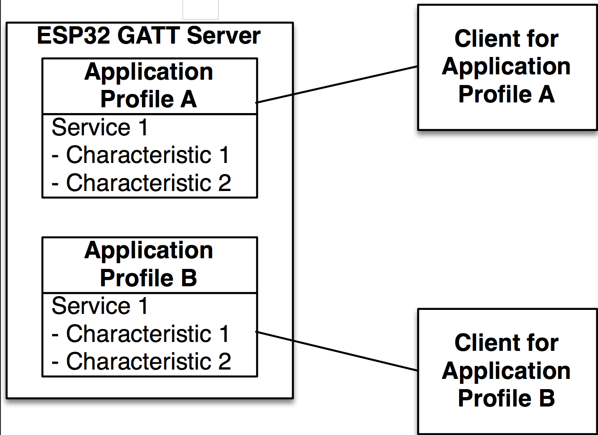

# Gatt Server Example Walkthrough

## Introduction

在本文中,我们回顾了在ESP32上实现蓝牙低功耗(BLE)通用属性配置文件(GATT)服务器的GATT SERVER示例代码.此示例围绕两个应用程序配置文件和一系列事件进行设计,以便执行一系列配置步骤,例如定义广播参数,更新连接参数以及创建服务和特性.另外,这个例子处理了读写事件,包括Write Long特性请求,它将传入的数据分成块,以便数据能够适应属性协议(ATT)消息.这个文档遵循程序工作流程并分解代码,以便理解实现背后的每个部分和推理.

## Includes

首先,让我们来看看包括:

```c
#include <stdio.h>
#include <stdlib.h>
#include <string.h>
#include "freertos/FreeRTOS.h"
#include "freertos/task.h"
#include "freertos/event_groups.h"
#include "esp_system.h"
#include "esp_log.h"
#include "nvs_flash.h"
#include "bt.h"
#include "bta_api.h"
#include "esp_gap_ble_api.h"
#include "esp_gatts_api.h"
#include "esp_bt_defs.h"
#include "esp_bt_main.h"
#include "sdkconfig.h"
```
这些包括FreeRTOS和下层系统组件需要运行,包括日志记录功能和库存储数据在非易失性闪存中.我们对`bt.h`,`esp_bt_main.h`,`esp_gap_ble_api.h`和`esp_gatts_api.h`感兴趣,它们公开了实现这个例子所需的BLE API.

* `bt.h`:从主机端实现BT控制器和VHCI配置程序.
* `esp_bt_main.h`:实现Bluedroid栈的初始化和启用.
* `esp_gap_ble_api.h`:实现GAP配置,例如广播和连接参数.
* `esp_gatts_api.h`:实现GATT配置,如创建服务和特性.

## Main Entry Point

这个例子的入口点是app_main()函数:

```c
 void app_main()
{
    esp_err_t ret;

    // 初始化 NVS.
    ret = nvs_flash_init();
    if (ret == ESP_ERR_NVS_NO_FREE_PAGES) {
        ESP_ERROR_CHECK(nvs_flash_erase());
        ret = nvs_flash_init();
    }
    ESP_ERROR_CHECK(ret);

    esp_bt_controller_config_t bt_cfg = BT_CONTROLLER_INIT_CONFIG_DEFAULT();
    ret = esp_bt_controller_init(&bt_cfg);
    if (ret) {
        ESP_LOGE(GATTS_TAG, "%s initialize controller failed\n", __func__);
        return;
    }

    ret = esp_bt_controller_enable(ESP_BT_MODE_BTDM);
    if (ret) {
        ESP_LOGE(GATTS_TAG, "%s enable controller failed\n", __func__);
        return;
    }
    ret = esp_bluedroid_init();
    if (ret) {
        ESP_LOGE(GATTS_TAG, "%s init bluetooth failed\n", __func__);
        return;
    }
    ret = esp_bluedroid_enable();
    if (ret) {
        ESP_LOGE(GATTS_TAG, "%s enable bluetooth failed\n", __func__);
        return;
    }

    ret = esp_ble_gatts_register_callback(gatts_event_handler);
    if (ret){
        ESP_LOGE(GATTS_TAG, "gatts register error, error code = %x", ret);
        return;
    }
    ret = esp_ble_gap_register_callback(gap_event_handler);
    if (ret){
        ESP_LOGE(GATTS_TAG, "gap register error, error code = %x", ret);
        return;
    }
    ret = esp_ble_gatts_app_register(PROFILE_A_APP_ID);
    if (ret){
        ESP_LOGE(GATTS_TAG, "gatts app register error, error code = %x", ret);
        return;
    }
    ret = esp_ble_gatts_app_register(PROFILE_B_APP_ID);
    if (ret){
        ESP_LOGE(GATTS_TAG, "gatts app register error, error code = %x", ret);
        return;
    }
    esp_err_t local_mtu_ret = esp_ble_gatt_set_local_mtu(512);
    if (local_mtu_ret){
        ESP_LOGE(GATTS_TAG, "set local  MTU failed, error code = %x", local_mtu_ret);
    }
    return;
} 
```
主函数通过初始化非易失性存储库来启动.该库允许将键值对保存在闪存中,并被某些组件(如Wi-Fi库)用于保存SSID和密码:

```c
ret = nvs_flash_init();
```
## BT Controller and Stack Initialization

主函数还通过首先创建一个名为`esp_bt_controller_config_t`的BT控制器配置结构初始化BT控制器,其结构由`BT_CONTROLLER_INIT_CONFIG_DEFAULT()`宏生成的默认设置. BT控制器在控制器侧实现主机控制器接口(HCI),链路层(LL)和物理层(PHY). BT控制器对于用户应用是不可见的,并且处理BLE堆栈的较低层.控制器配置包括设置BT控制器堆栈大小,优先级和HCI波特率.通过创建的设置,BT控制器被初始化并通过`esp_bt_controller_init()`函数启用:

```c
esp_bt_controller_config_t bt_cfg = BT_CONTROLLER_INIT_CONFIG_DEFAULT();
ret = esp_bt_controller_init(&bt_cfg);
```
接下来,在双模式(BLE + BT Classic)中启用控制器.

```c
ret = esp_bt_controller_enable(ESP_BT_MODE_BTDM);
```

有四种蓝牙模式支持:

1. `ESP_BT_MODE_IDLE`:蓝牙未运行
2. `ESP_BT_MODE_BLE`:BLE模式
3. `ESP_BT_MODE_CLASSIC_BT`:BT经典模式
4. `ESP_BT_MODE_BTDM`:双模(BLE + BT Classic)

在BT控制器初始化之后,包含BT Classic和BLE的通用定义和API的Bluedroid栈将被初始化并使用:

```c
ret = esp_bluedroid_init();
ret = esp_bluedroid_enable();
```
蓝牙堆栈已经在程序流程中的这一点上运行,但是应用程序的功能尚未定义.该功能是通过对诸如当另一个设备尝试读取或写入参数并建立连接时发生的事件作出反应来定义的.事件的两个主要管理者是GAP(Generic Access Profile 通用访问)和GATT事件处理程序.应用程序需要为每个事件处理程序注册一个回调函数,以便让应用程序知道哪些函数将处理GAP和GATT事件:

```c
esp_ble_gatts_register_callback(gatts_event_handler);
esp_ble_gap_register_callback(gap_event_handler);
```
函数`gatts_event_handler()`和`gap_event_handler()`处理从BLE堆栈推送到应用程序的所有事件.

## APPLICATION PROFILES

GATT服务器示例应用程序通过使用应用程序配置文件进行组织,如图1所示.每个应用程序配置文件描述了为一个客户端应用程序(例如在智能手机或平板电脑上运行的移动应用程序)设计的功能组合方法.通过这种方式,由不同的应用程序配置文件启用的单一设计,在被不同的智能手机应用程序使用时,行为可能会有所不同,从而允许服务器根据所使用的客户端应用程序做出不同的反应.实际上,客户将每个配置文件视为独立的BLE服务.客户歧视其感兴趣的服务.


<p align="center">Fig.1. Application Profiles are used to organize a BLE application in order to implement different functionality for different clients.</p>

每个配置文件被定义为一个结构,其中结构成员依赖于在该应用配置文件中实现的服务和特性.成员还包括一个GATT接口,应用程序ID,连接ID和一个回调函数来处理配置文件事件.在这个例子中,每个配置文件是由以下组成:

* GATT interface
* Application ID
* Connection ID
* Service handle
* Service ID
* Characteristic handle
* Characteristic UUID
* Attribute permissions
* Characteristic properties
* Client Characteristic Configuration descriptor handle
* Client Characteristic Configuration descriptor UUID

从这个结构可以看出,这个profile被设计成具有一个service(服务)和一个characteristic(特征),并且该characteristic具有一个descriptor(描述).该服务有一个handle和一个ID,每个characteristic都有一个handle,一个UUID,attribute permissions(属性权限)和properties(属性).另外,如果characteristic支持notifications(通知)或indications(指示),则它必须实现Client Characteristic Configuration descriptor(客户特征配置描述符)(CCCD),这是描述是否启用通知或指示并且定义特征如何由特定客户配置的附加属性.这个描述符也有一个句柄和一个UUID.

结构实现是:

```c
struct gatts_profile_inst {
    esp_gatts_cb_t gatts_cb;
    uint16_t gatts_if;
    uint16_t app_id;
    uint16_t conn_id;
    uint16_t service_handle;
    esp_gatt_srvc_id_t service_id;
    uint16_t char_handle;
    esp_bt_uuid_t char_uuid;
    esp_gatt_perm_t perm;
    esp_gatt_char_prop_t property;
    uint16_t descr_handle;
    esp_bt_uuid_t descr_uuid;
};
```
应用程序配置文件存储在一个数组中,并分配相应的回调函数`gatts_profile_a_event_handler()`和`gatts_profile_b_event_handler()`. GATT客户端上的不同应用程序使用不同的接口,由gatts_if参数表示.初始化时,此参数设置为`ESP_GATT_IF_NONE`,这意味着应用程序配置文件尚未链接到任何客户端.

```c
static struct gatts_profile_inst gl_profile_tab[PROFILE_NUM] = {
    [PROFILE_A_APP_ID] = {
        .gatts_cb = gatts_profile_a_event_handler,
        .gatts_if = ESP_GATT_IF_NONE,
    [PROFILE_B_APP_ID] = {
        .gatts_cb = gatts_profile_b_event_handler,
        .gatts_if = ESP_GATT_IF_NONE,
    },
};
```
最后,使用应用程序ID注册应用程序配置文件,该应用程序ID是用户分配的号码以识别每个配置文件.这样,多个应用程序配置文件可以在一个服务器上运行.

```c
esp_ble_gatts_app_register(PROFILE_A_APP_ID);
esp_ble_gatts_app_register(PROFILE_B_APP_ID);
```

## Setting GAP Parameters

FIXME:注册应用程序事件是程序生命周期中第一个触发事件,本例使用Profile A GATT事件句柄来配置注册时的广播参数.此示例可以选择使用标准的蓝牙核心规格广播参数或定制的原始缓冲区.该选项可以通过 `CONFIG_SET_RAW_ADV_DATA` 定义来选择.原始的广播数据可以用来实现iBeacons,Eddystone或其他专属,以及用于室内定位服务的定制框架类型,这些定制框架类型与标准规格不同.

`esp_ble_gap_config_adv_data()` 用于配置标准蓝牙规范广播参数,它的参数是指向 `esp_ble_adv_data_t` 结构的指针.用于广播数据的 `esp_ble_adv_data_t` 定义如下:

```cFIXME:
typedef struct {
    bool set_scan_rsp;            /*!< Set this advertising data as scan response or not*/
    bool include_name;            /*!< Advertising data include device name or not */
    bool include_txpower;         /*!< Advertising data include TX power */
    int min_interval;             /*!< Advertising data show advertising min interval */
    int max_interval;             /*!< Advertising data show advertising max interval */
    int appearance;               /*!< External appearance of device */
    uint16_t manufacturer_len;    /*!< Manufacturer data length */
    uint8_t *p_manufacturer_data; /*!< Manufacturer data point */
    uint16_t service_data_len;    /*!< Service data length */
    uint8_t *p_service_data;      /*!< Service data point */
    uint16_t service_uuid_len;    /*!< Service uuid length */
    uint8_t *p_service_uuid;      /*!< Service uuid array point */
    uint8_t flag;                 /*!< Advertising flag of discovery mode, see BLE_ADV_DATA_FLAG detail */
} esp_ble_adv_data_t;
```
在这个例子中,结构被初始化如下:

```c
static esp_ble_adv_data_t adv_data = {
    .set_scan_rsp = false,
    .include_name = true,
    .include_txpower = true,
    .min_interval = 0x20,
    .max_interval = 0x40,
    .appearance = 0x00,
    .manufacturer_len = 0, //TEST_MANUFACTURER_DATA_LEN,
    .p_manufacturer_data =  NULL, //&test_manufacturer[0],
    .service_data_len = 0,
    .p_service_data = NULL,
    .service_uuid_len = 32,
    .p_service_uuid = test_service_uuid128,
    .flag = (ESP_BLE_ADV_FLAG_GEN_DISC | ESP_BLE_ADV_FLAG_BREDR_NOT_SPT),
};
```
最小广播间隔和最大广播间隔设置为1.25毫秒的倍数.在本例中,最小广播时间间隔定义为0x20 * 1.25 ms = 40 ms,最大广播时间间隔初始化为0x40 * 1.25 ms = 80 ms.

FIXME:广播有效载荷可以达到31个字节的数据.参数数据可能超过31个字节的广播数据包限制,这将导致堆栈切断广播数据包,并留下一些参数.在这个例子中,如果制造商的长度和数据都没有注释,这个行为可以被证明,这使得服务在重新编译和测试之后不被公布.

也可以使用`esp_ble_gap_config_adv_data_raw()`来公布自定义的原始数据
和`esp_ble_gap_config_scan_rsp_data_raw()`函数,这些函数需要为广播数据和扫描响应数据创建并传递一个缓冲区.在本例中,原始数据由`raw_adv_data []`和`raw_scan_rsp_data []`数组表示.

最后,要设置设备名称,使用`esp_ble_gap_set_device_name()`函数.注册事件处理程序如下所示:

```c
static void gatts_profile_a_event_handler(esp_gatts_cb_event_t event, esp_gatt_if_t gatts_if, esp_ble_gatts_cb_param_t *param) {
    switch (event) {
    case ESP_GATTS_REG_EVT:
         ESP_LOGI(GATTS_TAG, "REGISTER_APP_EVT, status %d, app_id %d\n", param->reg.status, param->reg.app_id);
         gl_profile_tab[PROFILE_A_APP_ID].service_id.is_primary = true;
         gl_profile_tab[PROFILE_A_APP_ID].service_id.id.inst_id = 0x00;
         gl_profile_tab[PROFILE_A_APP_ID].service_id.id.uuid.len = ESP_UUID_LEN_16;
         gl_profile_tab[PROFILE_A_APP_ID].service_id.id.uuid.uuid.uuid16 = GATTS_SERVICE_UUID_TEST_A;

         esp_ble_gap_set_device_name(TEST_DEVICE_NAME);
#ifdef CONFIG_SET_RAW_ADV_DATA
        esp_err_t raw_adv_ret = esp_ble_gap_config_adv_data_raw(raw_adv_data, sizeof(raw_adv_data));
        if (raw_adv_ret){
            ESP_LOGE(GATTS_TAG, "config raw adv data failed, error code = %x ", raw_adv_ret);
        }
        adv_config_done |= adv_config_flag;
        esp_err_t raw_scan_ret = esp_ble_gap_config_scan_rsp_data_raw(raw_scan_rsp_data, sizeof(raw_scan_rsp_data));
        if (raw_scan_ret){
            ESP_LOGE(GATTS_TAG, "config raw scan rsp data failed, error code = %x", raw_scan_ret);
        }
        adv_config_done |= scan_rsp_config_flag;
#else
        //config adv data
        esp_err_t ret = esp_ble_gap_config_adv_data(&adv_data);
        if (ret){
            ESP_LOGE(GATTS_TAG, "config adv data failed, error code = %x", ret);
        }
        adv_config_done |= adv_config_flag;
        //config scan response data
        ret = esp_ble_gap_config_adv_data(&scan_rsp_data);
        if (ret){
            ESP_LOGE(GATTS_TAG, "config scan response data failed, error code = %x", ret);
        }
        adv_config_done |= scan_rsp_config_flag;
#endif
```
## GAP Event Handler

一旦广播数据被设置,GAP事件`ESP_GAP_BLE_ADV_DATA_SET_COMPLETE_EVT`被触发.对于原始广播数据集的情况,触发的事件是`ESP_GAP_BLE_ADV_DATA_RAW_SET_COMPLETE_EVT`.另外,当原始扫描响应数据被设置时,触发`ESP_GAP_BLE_SCAN_RSP_DATA_RAW_SET_COMPLETE_EVT`事件.

```c
static void gap_event_handler(esp_gap_ble_cb_event_t event, esp_ble_gap_cb_param_t *param)
{   
    switch (event) {
    #ifdef CONFIG_SET_RAW_ADV_DATA
    case ESP_GAP_BLE_ADV_DATA_RAW_SET_COMPLETE_EVT:
         adv_config_done &= (~adv_config_flag);
         if (adv_config_done==0){
             esp_ble_gap_start_advertising(&adv_params);
         }
         break;
    case ESP_GAP_BLE_SCAN_RSP_DATA_RAW_SET_COMPLETE_EVT:
         adv_config_done &= (~scan_rsp_config_flag);
         if (adv_config_done==0){
             esp_ble_gap_start_advertising(&adv_params);
         }
         break;
#else
    case ESP_GAP_BLE_ADV_DATA_SET_COMPLETE_EVT:
         adv_config_done &= (~adv_config_flag);
         if (adv_config_done == 0){
             esp_ble_gap_start_advertising(&adv_params);
         }
         break;
    case ESP_GAP_BLE_SCAN_RSP_DATA_SET_COMPLETE_EVT:
         adv_config_done &= (~scan_rsp_config_flag);
         if (adv_config_done == 0){
             esp_ble_gap_start_advertising(&adv_params);
         }
         break;
#endif
…
```
在任何情况下,服务器都可以使用`esp_ble_gap_start_advertising()`函数开始广播,该函数采用`esp_ble_adv_params_t`类型的结构,其中堆栈需要广播参数进行操作:

```c
/// Advertising parameters
typedef struct {
    uint16_t adv_int_min; 
    /*!< Minimum advertising interval for undirected and low duty cycle directed advertising.
 					Range: 0x0020 to 0x4000
 					Default: N = 0x0800 (1.28 second)
					Time = N * 0.625 msec
					Time Range: 20 ms to 10.24 sec */
    uint16_t adv_int_max; 
    /*!< Maximum advertising interval for undirected and low duty
					cycle directed advertising. 
					Range: 0x0020 to 0x4000 
					Default: N = 0x0800 (1.28 second)
					Time = N * 0.625 msec 
					Time Range: 20 ms to 10.24 sec */
    esp_ble_adv_type_t adv_type;            /*!< Advertising type */
    esp_ble_addr_type_t own_addr_type;      /*!< Owner bluetooth device address type */
    esp_bd_addr_t peer_addr;                /*!< Peer device bluetooth device address */
    esp_ble_addr_type_t peer_addr_type;     /*!< Peer device bluetooth device address type */
    esp_ble_adv_channel_t channel_map;      /*!< Advertising channel map */
    esp_ble_adv_filter_t adv_filter_policy; /*!< Advertising filter policy */
} 
esp_ble_adv_params_t;
```

请注意,`esp_ble_gap_config_adv_data()`配置将要广播给客户端的数据,并采用`esp_ble_adv_data_t`结构,而`esp_ble_gap_start_advertising()`使服务器真正开始广播并采用`esp_ble_adv_params_t`结构.广播数据是显示给客户端的信息,而广播参数是GAP执行所需的配置.

对于这个例子,广播参数被初始化如下:

```c
static esp_ble_adv_params_t test_adv_params = {
    .adv_int_min        = 0x20,
    .adv_int_max        = 0x40,
    .adv_type           = ADV_TYPE_IND,
    .own_addr_type      = BLE_ADDR_TYPE_PUBLIC,
    //.peer_addr        =
    //.peer_addr_type   =
    .channel_map        = ADV_CHNL_ALL,
    .adv_filter_policy  = ADV_FILTER_ALLOW_SCAN_ANY_CON_ANY,
};
```

这些参数将广播时间间隔配置为40毫秒到80毫秒.广播是`ADV_IND`,它是通用的,不针对特定的中央设备和可连接类型.地址类型是公共的,使用所有通道并允许来自任何中央的扫描和连接请求.

如果广播成功启动,则产生一个`ESP_GAP_BLE_ADV_START_COMPLETE_EVT`事件,在这个例子中用来检查广播状态是否确实是广播.否则,会打印一条错误消息.

```c
…
    case ESP_GAP_BLE_ADV_START_COMPLETE_EVT:
    //advertising start complete event to indicate advertising start successfully or failed
         if (param->adv_start_cmpl.status != ESP_BT_STATUS_SUCCESS) {
             ESP_LOGE(GATTS_TAG, "Advertising start failed\n");
         }
         break;
…
```

## GATT Event Handlers

注册应用程序配置文件时,将触发`ESP_GATTS_REG_EVT`事件. `ESP_GATTS_REG_EVT`的参数是:

* `esp_gatt_status_t status;　/*!< Operation status */`
* `uint16_t app_id;　　　　　　　/*!< Application id which input in register API */`

除了以前的参数外,事件还包含由BLE堆栈分配的GATT接口.事件被`gatts_event_handler()`捕获,用于将生成的接口存储在配置文件表中,然后事件被转发到相应的配置文件事件处理程序.
 
```c
static void gatts_event_handler(esp_gatts_cb_event_t event, esp_gatt_if_t gatts_if, esp_ble_gatts_cb_param_t *param)
{
    /* If event is register event, store the gatts_if for each profile */
    if (event == ESP_GATTS_REG_EVT) {
        if (param->reg.status == ESP_GATT_OK) {
            gl_profile_tab[param->reg.app_id].gatts_if = gatts_if;
        } else {
            ESP_LOGI(GATTS_TAG, "Reg app failed, app_id %04x, status %d\n",
                    param->reg.app_id,
                    param->reg.status);
            return;
        }
    }

/* If the gatts_if equal to profile A, call profile A cb handler,
 * so here call each profile's callback */
    do {
        int idx;
        for (idx = 0; idx < PROFILE_NUM; idx++) {
            if (gatts_if == ESP_GATT_IF_NONE||gatts_if == gl_profile_tab[idx].gatts_if) 			{
                if (gl_profile_tab[idx].gatts_cb) {
                    gl_profile_tab[idx].gatts_cb(event, gatts_if, param);
                }
            }
        }
    } while (0);
}
```
 
## Creating Services

注册事件也用于通过使用`esp_ble_gatts_create_attr_tab()`函数来创建配置文件属性表,该函数采用包含服务表所有信息的`esp_gatts_attr_db_t`类型的结构.创建这个表的方法是:

```c
…
esp_ble_gatts_create_service(gatts_if, &gl_profile_tab[PROFILE_A_APP_ID].service_id, GATTS_NUM_HANDLE_TEST_A);
break;
…
```
句柄的数量定义为4:

```c
#define GATTS_NUM_HANDLE_TEST_A     4
```

这些句柄是:

1. Service handle 服务句柄
2. Characteristic handle 特征值句柄
3. Characteristic value handle 特征值处理
4. Characteristic descriptor handle 特征描述符句柄

该服务被定义为UUID长度为16位的主要服务.服务ID用实例ID = 0和由`GATTS_SERVICE_UUID_TEST_A`定义的UUID初始化.

服务实例ID可用于区分具有相同UUID的多个服务.在此示例中,由于每个应用程序配置文件只有一个服务,并且服务具有不同的UUID,因此在配置文件A和配置文件B中都可以将服务实例ID定义为0.但是,如果只有一个应用程序配置文件使用两个服务相同的UUID,则有必要使用不同的实例ID来引用一个服务或另一个服务.

应用程序配置文件B以与配置文件A相同的方式创建服务:

```c
static void gatts_profile_b_event_handler(esp_gatts_cb_event_t event, esp_gatt_if_t gatts_if, esp_ble_gatts_cb_param_t *param) {
    switch (event) {
    case ESP_GATTS_REG_EVT:
         ESP_LOGI(GATTS_TAG, "REGISTER_APP_EVT, status %d, app_id %d\n", param->reg.status, param->reg.app_id);
         gl_profile_tab[PROFILE_B_APP_ID].service_id.is_primary = true;
         gl_profile_tab[PROFILE_B_APP_ID].service_id.id.inst_id = 0x00;
         gl_profile_tab[PROFILE_B_APP_ID].service_id.id.uuid.len = ESP_UUID_LEN_16;
         gl_profile_tab[PROFILE_B_APP_ID].service_id.id.uuid.uuid.uuid16 = GATTS_SERVICE_UUID_TEST_B;

         esp_ble_gatts_create_service(gatts_if, &gl_profile_tab[PROFILE_B_APP_ID].service_id, GATTS_NUM_HANDLE_TEST_B);
         break;
…
}
```

## Starting Services and Creating Characteristics

当一个服务成功创建时,一个由配置文件GATT处理程序管理的`ESP_GATTS_CREATE_EVT`事件被触发,并且可以用来启动服务并向服务添加特性.对于配置文件A的情况,服务启动并添加特征如下:

```c
case ESP_GATTS_CREATE_EVT:
     ESP_LOGI(GATTS_TAG, "CREATE_SERVICE_EVT, status %d, service_handle %d\n", param->create.status, param->create.service_handle);
     gl_profile_tab[PROFILE_A_APP_ID].service_handle = param->create.service_handle;
     gl_profile_tab[PROFILE_A_APP_ID].char_uuid.len = ESP_UUID_LEN_16;
     gl_profile_tab[PROFILE_A_APP_ID].char_uuid.uuid.uuid16 = GATTS_CHAR_UUID_TEST_A;  
     
     esp_ble_gatts_start_service(gl_profile_tab[PROFILE_A_APP_ID].service_handle);
     a_property = ESP_GATT_CHAR_PROP_BIT_READ | ESP_GATT_CHAR_PROP_BIT_WRITE | ESP_GATT_CHAR_PROP_BIT_NOTIFY;
     esp_err_t add_char_ret =  
     esp_ble_gatts_add_char(gl_profile_tab[PROFILE_A_APP_ID].service_handle,  
                            &gl_profile_tab[PROFILE_A_APP_ID].char_uuid,  
                            ESP_GATT_PERM_READ | ESP_GATT_PERM_WRITE,  
                            a_property,  
                            &gatts_demo_char1_val,  
                            NULL);
    if (add_char_ret){
        ESP_LOGE(GATTS_TAG, "add char failed, error code =%x",add_char_ret);
    }
    break;
```

首先,由BLE堆栈生成的服务句柄存储在简档表中,稍后由应用层用来引用该服务.然后,设置特征的UUID和它的UUID长度.特征UUID的长度也是16位.该服务使用先前生成的服务句柄的`esp_ble_gatts_start_service()`函数启动.触发用于打印信息的`ESP_GATTS_START_EVT`事件.该特性通过`esp_ble_gatts_start_service()`函数与特性权限和属性一起被添加到服务中.在这个例子中,两个配置文件中的特征设置如下:

Permissions 权限:

* `ESP_GATT_PERM_READ`:允许读取特征值
* `ESP_GATT_PERM_WRITE`:允许写入特征值

Properties 属性:

* `ESP_GATT_CHAR_PROP_BIT_READ`:可以读取特征
* `ESP_GATT_CHAR_PROP_BIT_WRITE`:可以写入特征
* `ESP_GATT_CHAR_PROP_BIT_NOTIFY`:特征可以通知值的变化

具有读写权限和属性似乎是多余的.但是,属性的​​读取和写入属性是向客户端显示的信息,以便让客户端知道服务器是否接受读取和写入请求.在这个意义上,这些属性可以作为提示客户正确访问服务器资源.另一方面,权限是授予客户端读取或写入该属性的授权.例如,如果客户端尝试写入没有写入权限的属性,则即使设置了写入属性,服务器也会拒绝该请求.

另外,这个例子给出由`gatts_demo_char1_val`表示的特征的初始值.初始值定义如下:

```c
esp_attr_value_t gatts_demo_char1_val =
{
    .attr_max_len = GATTS_DEMO_CHAR_VAL_LEN_MAX,
    .attr_len     = sizeof(char1_str),
    .attr_value   = char1_str,
};
```
其中`char1_str`是虚拟数据:

```c
uint8_t char1_str[] = {0x11,0x22,0x33};
```

特征长度定义为:

```c
#define GATTS_DEMO_CHAR_VAL_LEN_MAX 0x40
```

特征初始值必须是非空对象,特征长度必须总是大于零,否则堆栈将返回一个错误.

最后,配置特性的方式是每次读取或写入特性时都需要手动发送响应,而不是让堆栈自动响应.这是通过将`esp_ble_gatts_add_char()`函数的最后一个参数(代表属性响应控制参数)设置为`ESP_GATT_RSP_BY_APP`或NULL来配置的.

## Creating the Characteristic Descriptor

向服务添加一个特性会触发一个`ESP_GATTS_ADD_CHAR_EVT`事件,该事件返回堆栈为刚添加的特性而生成的句柄.该事件包含以下参数:

* `esp_gatt_status_t status;　　　　　/*!< Operation status */`
* `uint16_t attr_handle;　　　　　　　/*!< Characteristic attribute handle */`
* `uint16_t service_handle;　　　　　/*!< Service attribute handle */`
* `esp_bt_uuid_t char_uuid;　　　　　/*!< Characteristic uuid */`

由事件返回的属性句柄存储在配置文件表中,特征描述符长度和UUID也被设置.使用`esp_ble_gatts_get_attr_value()`函数读取特征长度和值,然后打印出来供参考.最后,使用`esp_ble_gatts_add_char_descr()`函数添加特征描述.使用的参数是服务句柄,描述符UUID,写入和读取权限,初始值和自动响应设置.特征描述符的初始值可以是NULL指针,自动响应参数也设置为NULL,这意味着需要响应的请求必须手动回复.

```c
    case ESP_GATTS_ADD_CHAR_EVT: {
         uint16_t length = 0;
         const uint8_t *prf_char;

         ESP_LOGI(GATTS_TAG, "ADD_CHAR_EVT, status %d,  attr_handle %d, service_handle %d\n",
                 param->add_char.status, param->add_char.attr_handle, param->add_char.service_handle);  
                 gl_profile_tab[PROFILE_A_APP_ID].char_handle = param->add_char.attr_handle;
                 gl_profile_tab[PROFILE_A_APP_ID].descr_uuid.len = ESP_UUID_LEN_16;  
                 gl_profile_tab[PROFILE_A_APP_ID].descr_uuid.uuid.uuid16 = ESP_GATT_UUID_CHAR_CLIENT_CONFIG;  
                 esp_err_t get_attr_ret = esp_ble_gatts_get_attr_value(param->add_char.attr_handle, &length, &prf_char);         
         if (get_attr_ret == ESP_FAIL){  
	           ESP_LOGE(GATTS_TAG, "ILLEGAL HANDLE");
         }
         ESP_LOGI(GATTS_TAG, "the gatts demo char length = %x\n", length);
         for(int i = 0; i < length; i++){
             ESP_LOGI(GATTS_TAG, "prf_char[%x] = %x\n",i,prf_char[i]);
         }       
         esp_err_t add_descr_ret = esp_ble_gatts_add_char_descr(  
                                 gl_profile_tab[PROFILE_A_APP_ID].service_handle,  
                                 &gl_profile_tab[PROFILE_A_APP_ID].descr_uuid,  
                                 ESP_GATT_PERM_READ | ESP_GATT_PERM_WRITE,  
                                 NULL,NULL);
         if (add_descr_ret){
            ESP_LOGE(GATTS_TAG, "add char descr failed, error code = %x", add_descr_ret);
         }
         break;
    }
```

一旦描述符被添加,就会触发`ESP_GATTS_ADD_CHAR_DESCR_EVT`事件,在这个例子中用来打印信息消息.

```c
    case ESP_GATTS_ADD_CHAR_DESCR_EVT:
         ESP_LOGI(GATTS_TAG, "ADD_DESCR_EVT, status %d, attr_handle %d, service_handle %d\n",
                  param->add_char.status, param->add_char.attr_handle,  
                  param->add_char.service_handle);
         break;
```
在配置文件B事件处理程序中重复此过程,以便为该配置文件创建服务和特征.

## Connection Event

当客户端连接到GATT服务器时,将触发`ESP_GATTS_CONNECT_EVT`.此事件用于更新连接参数,例如延迟,最小连接间隔,最大连接间隔和超时.连接参数存储在`esp_ble_conn_update_params_t`结构中,然后传递给`esp_ble_gap_update_conn_params()`函数.更新连接参数过程只需要完成一次,因此配置文件B连接事件处理程序不包括`esp_ble_gap_update_conn_params()`函数.最后,事件返回的连接ID存储在配置文件表中.

配置文件连接事件:

```c
case ESP_GATTS_CONNECT_EVT: {  
     esp_ble_conn_update_params_t conn_params = {0};  
     memcpy(conn_params.bda, param->connect.remote_bda, sizeof(esp_bd_addr_t));
     /* For the IOS system, please reference the apple official documents about the ble connection parameters restrictions. */
     conn_params.latency = 0;  
     conn_params.max_int = 0x30;    // max_int = 0x30*1.25ms = 40ms  
     conn_params.min_int = 0x10;    // min_int = 0x10*1.25ms = 20ms   
     conn_params.timeout = 400;     // timeout = 400*10ms = 4000ms  
     ESP_LOGI(GATTS_TAG, "ESP_GATTS_CONNECT_EVT, conn_id %d, remote %02x:%02x:%02x:%02x:%02x:%02x:, is_conn %d",  
             param->connect.conn_id,  
             param->connect.remote_bda[0],  
             param->connect.remote_bda[1],  
             param->connect.remote_bda[2],  
             param->connect.remote_bda[3],  
             param->connect.remote_bda[4],  
             param->connect.remote_bda[5],  
             param->connect.is_connected);
 	 gl_profile_tab[PROFILE_A_APP_ID].conn_id = param->connect.conn_id;
	 //start sent the update connection parameters to the peer device.
	 esp_ble_gap_update_conn_params(&conn_params);
	 break;
    }
```

配置文件B连接事件:

```c
case ESP_GATTS_CONNECT_EVT:  
     ESP_LOGI(GATTS_TAG, "CONNECT_EVT, conn_id %d, remote %02x:%02x:%02x:%02x:%02x:%02x:, is_conn %d\n",  
              param->connect.conn_id,  
              param->connect.remote_bda[0],  
              param->connect.remote_bda[1],  
              param->connect.remote_bda[2],  
              param->connect.remote_bda[3],  
              param->connect.remote_bda[4],  
              param->connect.remote_bda[5],  
              param->connect.is_connected);
	  gl_profile_tab[PROFILE_B_APP_ID].conn_id = param->connect.conn_id;
	  break;
```

`esp_ble_gap_update_conn_params()`函数触发一个GAP事件`ESP_GAP_BLE_UPDATE_CONN_PARAMS_EVT`,用于打印连接信息:

```c
    case ESP_GAP_BLE_UPDATE_CONN_PARAMS_EVT:
         ESP_LOGI(GATTS_TAG, "update connetion params status = %d, min_int = %d, max_int = %d,  
                  conn_int = %d,latency = %d, timeout = %d",
                  param->update_conn_params.status,
                  param->update_conn_params.min_int,
                  param->update_conn_params.max_int,
                  param->update_conn_params.conn_int,
                  param->update_conn_params.latency,
                  param->update_conn_params.timeout);
         break;
```

## Managing Read Events

现在,服务和特性已经被创建和启动,程序可以接收读写事件.读取操作由`ESP_GATTS_READ_EVT`事件表示,其具有以下参数:

* `uint16_t conn_id;　　　　　/*!< Connection id */`
* `uint32_t trans_id;　　　　　/*!< Transfer id */`
* `esp_bd_addr_t bda;　　　　　/*!< The bluetooth device address which been read */`
* `uint16_t handle;　　　　　　/*!< The attribute handle */`
* `uint16_t offset;　　　　　　/*!< Offset of the value, if the value is too long */`
* `bool is_long;　　　　　　　　/*!< The value is too long or not */`
* `bool need_rsp;　　　　　　　/*!< The read operation need to do response */`

在这个例子中,使用虚拟数据构造响应,并使用事件给定的相同句柄将其发送回主机.除了响应之外,GATT接口,连接ID和传输ID也作为参数包含在`esp_ble_gatts_send_response()`函数中.如果在创建特征或描述符时将自动响应字节设置为NULL,则此函数是必需的.

```c
case ESP_GATTS_READ_EVT: {
     ESP_LOGI(GATTS_TAG, "GATT_READ_EVT, conn_id %d, trans_id %d, handle %d\n",  
              param->read.conn_id, param->read.trans_id, param->read.handle);  
              esp_gatt_rsp_t rsp;  
              memset(&rsp, 0, sizeof(esp_gatt_rsp_t));  
              rsp.attr_value.handle = param->read.handle;  
              rsp.attr_value.len = 4;  
              rsp.attr_value.value[0] = 0xde;  
              rsp.attr_value.value[1] = 0xed;  
              rsp.attr_value.value[2] = 0xbe;  
              rsp.attr_value.value[3] = 0xef;  
              esp_ble_gatts_send_response(gatts_if,  
                                          param->read.conn_id,  
                                          param->read.trans_id,  
                                          ESP_GATT_OK, &rsp);
     break;
    }
```

## Managing Write Events

写入事件由具有以下参数的`ESP_GATTS_WRITE_EVT`事件表示:

* `uint16_t conn_id;　　　　　/*!< Connection id */`
* `uint32_t trans_id;　　　　/*!< Transfer id */`
* `esp_bd_addr_t bda;　　　　/*!< The bluetooth device address which been written */`
* `uint16_t handle;　　　　　/*!< The attribute handle */`
* `uint16_t offset;　　　　　/*!< Offset of the value, if the value is too long */`
* `bool need_rsp;　　　　　　/*!< The write operation need to do response */`
* `bool is_prep;　　　　　　　/*!< This write operation is prepare write */`
* `uint16_t len;　　　　　　　/*!< The write attribute value length */`
* `uint8_t *value;　　　　　　/*!< The write attribute value */`

在这个例子中,写入事件有两种类型,写入特征值和写入长期特征值.当特征值可以适应一个通常为23个字节的属性协议最大传输单元(ATT MTU)时使用第一种写入.第二种类型用于当要写入的属性长于可以在单个ATT消息中发送的属性时,通过使用准备写入响应将数据划分为多个块,然后使用执行写入请求来确认或取消完整的写入请求.该行为在[蓝牙规范版本4.2](https://www.bluetooth.com/specifications/bluetooth-core-specification)第3卷第G部分4.9节中定义.写长特征消息流程如图2所示.

当写入事件被触发时,这个例子打印日志消息,然后执行`example_write_event_env()`函数.

```c
case ESP_GATTS_WRITE_EVT: {                          
     ESP_LOGI(GATTS_TAG, "GATT_WRITE_EVT, conn_id %d, trans_id %d, handle %d\n", param->write.conn_id, param->write.trans_id, param->write.handle);
     if (!param->write.is_prep){
        ESP_LOGI(GATTS_TAG, "GATT_WRITE_EVT, value len %d, value :", param->write.len);
        esp_log_buffer_hex(GATTS_TAG, param->write.value, param->write.len);
        if (gl_profile_tab[PROFILE_B_APP_ID].descr_handle == param->write.handle && param->write.len == 2){
            uint16_t descr_value= param->write.value[1]<<8 | param->write.value[0];
            if (descr_value == 0x0001){
                if (b_property & ESP_GATT_CHAR_PROP_BIT_NOTIFY){
                    ESP_LOGI(GATTS_TAG, "notify enable");
                    uint8_t notify_data[15];
                    for (int i = 0; i < sizeof(notify_data); ++i)
                    {
                         notify_data[i] = i%0xff;  
                     }
                     //the size of notify_data[] need less than MTU size
                     esp_ble_gatts_send_indicate(gatts_if, param->write.conn_id,  
                                                 gl_profile_tab[PROFILE_B_APP_ID].char_handle,  
                                                 sizeof(notify_data),  
                                                 notify_data, false);
                }
            }else if (descr_value == 0x0002){
                 if (b_property & ESP_GATT_CHAR_PROP_BIT_INDICATE){
                     ESP_LOGI(GATTS_TAG, "indicate enable");
                     uint8_t indicate_data[15];
                     for (int i = 0; i < sizeof(indicate_data); ++i)
                     {
                         indicate_data[i] = i % 0xff;
                      }
                      //the size of indicate_data[] need less than MTU size
                     esp_ble_gatts_send_indicate(gatts_if, param->write.conn_id,  
                                                 gl_profile_tab[PROFILE_B_APP_ID].char_handle,  
                                                 sizeof(indicate_data),  
                                                 indicate_data, true);
                }
             }
             else if (descr_value == 0x0000){
                 ESP_LOGI(GATTS_TAG, "notify/indicate disable ");
             }else{
                 ESP_LOGE(GATTS_TAG, "unknown value");
             }
        }
    }
    example_write_event_env(gatts_if, &a_prepare_write_env, param); 
    break;
}
```


 <p align="center">Fig.2. Message flow for Write Long Characteristic</p> 

`example_write_event_env()`函数包含写入长特征过程的逻辑:

```c
void example_write_event_env(esp_gatt_if_t gatts_if, prepare_type_env_t *prepare_write_env, esp_ble_gatts_cb_param_t *param){
    esp_gatt_status_t status = ESP_GATT_OK;
    if (param->write.need_rsp){
       if (param->write.is_prep){
            if (prepare_write_env->prepare_buf == NULL){
                prepare_write_env->prepare_buf = (uint8_t *)malloc(PREPARE_BUF_MAX_SIZE*sizeof(uint8_t));
                prepare_write_env->prepare_len = 0;
                if (prepare_write_env->prepare_buf == NULL) {
                    ESP_LOGE(GATTS_TAG, "Gatt_server prep no mem\n");
                    status = ESP_GATT_NO_RESOURCES;
                }
            } else {
                if(param->write.offset > PREPARE_BUF_MAX_SIZE) {
                    status = ESP_GATT_INVALID_OFFSET;
                } 
                else if ((param->write.offset + param->write.len) > PREPARE_BUF_MAX_SIZE) {
                    status = ESP_GATT_INVALID_ATTR_LEN;
                }
            }

            esp_gatt_rsp_t *gatt_rsp = (esp_gatt_rsp_t *)malloc(sizeof(esp_gatt_rsp_t));
            gatt_rsp->attr_value.len = param->write.len;
            gatt_rsp->attr_value.handle = param->write.handle;
            gatt_rsp->attr_value.offset = param->write.offset;
            gatt_rsp->attr_value.auth_req = ESP_GATT_AUTH_REQ_NONE;
            memcpy(gatt_rsp->attr_value.value, param->write.value, param->write.len);
            esp_err_t response_err = esp_ble_gatts_send_response(gatts_if, param->write.conn_id,  
                                                                 param->write.trans_id, status, gatt_rsp);
            if (response_err != ESP_OK){
               ESP_LOGE(GATTS_TAG, "Send response error\n");
            }
            free(gatt_rsp);
            if (status != ESP_GATT_OK){
                return;
            }
            memcpy(prepare_write_env->prepare_buf + param->write.offset,
                   param->write.value,
                   param->write.len);
            prepare_write_env->prepare_len += param->write.len;

        }else{
            esp_ble_gatts_send_response(gatts_if, param->write.conn_id, param->write.trans_id, status, NULL);
        }
    }
} 
```

当客户端发送写请求或准备写请求时,服务器应该响应.但是,如果客户端发送“无响应写入”命令,则服务器不需要回复响应.通过检查`write.need_rsp`参数的值来检查写入过程.如果需要应答,程序继续进行应答准备,如果不存在,则客户不需要应答,因此程序结束.

```c
void example_write_event_env(esp_gatt_if_t gatts_if, prepare_type_env_t *prepare_write_env,  
                             esp_ble_gatts_cb_param_t *param){
    esp_gatt_status_t status = ESP_GATT_OK;
    if (param->write.need_rsp){
…
```

然后该函数检查是否设置了由`write.is_prep`表示的Prepare Write Request参数,这意味着客户端正在请求Write Long特性.如果存在,则程序继续准备多个写入响应,如果不存在,则服务器简单地发送单个写入响应.

```c
…
if (param->write.is_prep){
…
}else{
	esp_ble_gatts_send_response(gatts_if, param->write.conn_id, param->write.trans_id, status, NULL);
}
…
```

为了处理长时间的特征写入,定义并实例化了一个准备缓冲区结构:

```c
typedef struct {
    uint8_t                 *prepare_buf;
    int                      prepare_len;
} prepare_type_env_t;

static prepare_type_env_t a_prepare_write_env;
static prepare_type_env_t b_prepare_write_env;
```
为了使用准备缓冲区,分配了一些内存空间.如果由于内存不足而导致分配失败,则会显示错误信息:

```c
if (prepare_write_env->prepare_buf == NULL) {
    prepare_write_env->prepare_buf =  
    (uint8_t*)malloc(PREPARE_BUF_MAX_SIZE*sizeof(uint8_t));  
    prepare_write_env->prepare_len = 0;
    if (prepare_write_env->prepare_buf == NULL) {  
       ESP_LOGE(GATTS_TAG, "Gatt_server prep no mem\n");
       status = ESP_GATT_NO_RESOURCES;
    }
}
```

如果缓冲区不是NULL(意味着初始化完成),则过程将检查传入写入的偏移量和消息长度是否适合缓冲区.

```c
else {
	if(param->write.offset > PREPARE_BUF_MAX_SIZE) {
		status = ESP_GATT_INVALID_OFFSET;
	} 
	else if ((param->write.offset + param->write.len) > PREPARE_BUF_MAX_SIZE) {
		 status = ESP_GATT_INVALID_ATTR_LEN;
	}
}
```

现在,程序准备将类型为`esp_gatt_rsp_t`的响应发送回客户端.它使用写请求的相同参数构造的响应,如长度,句柄和偏移量.另外,写入这个特性所需要的GATT认证类型是用`ESP_GATT_AUTH_REQ_NONE`设置的,这意味着客户端可以写入这个特性而不需要首先认证.一旦发送响应,释放分配给它的内存.

```c
esp_gatt_rsp_t *gatt_rsp = (esp_gatt_rsp_t *)malloc(sizeof(esp_gatt_rsp_t));
gatt_rsp->attr_value.len = param->write.len;
gatt_rsp->attr_value.handle = param->write.handle;
gatt_rsp->attr_value.offset = param->write.offset;
gatt_rsp->attr_value.auth_req = ESP_GATT_AUTH_REQ_NONE;
memcpy(gatt_rsp->attr_value.value, param->write.value, param->write.len);
esp_err_t response_err = esp_ble_gatts_send_response(gatts_if, param->write.conn_id,  
                                                     param->write.trans_id, status, gatt_rsp);
if (response_err != ESP_OK){
	ESP_LOGE(GATTS_TAG, "Send response error\n");
}
free(gatt_rsp);
if (status != ESP_GATT_OK){
	return;
}
```
最后,传入的数据被复制到创建的缓冲区中,并且其长度增加了偏移量:

```c
memcpy(prepare_write_env->prepare_buf + param->write.offset,
       param->write.value,  
       param->write.len);
prepare_write_env->prepare_len += param->write.len;
```
客户端通过发送执行写请求完成长写序列.该命令触发一个`ESP_GATTS_EXEC_WRITE_EVT`事件.服务器通过发送一个响应并执行`example_exec_write_event_env()`函数来处理这个事件:

```c
case ESP_GATTS_EXEC_WRITE_EVT:  
     ESP_LOGI(GATTS_TAG,"ESP_GATTS_EXEC_WRITE_EVT");  
     esp_ble_gatts_send_response(gatts_if, param->write.conn_id, param->write.trans_id, ESP_GATT_OK, NULL);  
     example_exec_write_event_env(&a_prepare_write_env, param);  
     break;
```
让我们来看看执行写功能:

```c
void example_exec_write_event_env(prepare_type_env_t *prepare_write_env, esp_ble_gatts_cb_param_t *param){
    if (param->exec_write.exec_write_flag == ESP_GATT_PREP_WRITE_EXEC){
        esp_log_buffer_hex(GATTS_TAG, prepare_write_env->prepare_buf, prepare_write_env->prepare_len);
    }
    else{
        ESP_LOGI(GATTS_TAG,"ESP_GATT_PREP_WRITE_CANCEL");
    }
    if (prepare_write_env->prepare_buf) {
        free(prepare_write_env->prepare_buf);
        prepare_write_env->prepare_buf = NULL;
    }
    prepare_write_env->prepare_len = 0;
}
```

执行写入用于确认或取消之前完成的写入过程，通过长特征写入过程。 为了做到这一点，函数检查事件接收的参数中的`exec_write_flag`。 如果该标志等于`exec_write_flag`表示的执行标志，则写入被确认并且缓冲区被打印在日志中; 如果不是，则意味着写入被取消，所有已写入的数据被删除。

```c
if (param->exec_write.exec_write_flag == ESP_GATT_PREP_WRITE_EXEC){  
   esp_log_buffer_hex(GATTS_TAG,  
                      prepare_write_env->prepare_buf,  
                      prepare_write_env->prepare_len);
 }
else{
    ESP_LOGI(GATTS_TAG,"ESP_GATT_PREP_WRITE_CANCEL");
 }
```
最后,为了存储长写入操作中的数据块而创建的缓冲区结构被释放,并且其指针被设置为NULL,以便为下一个长的写入过程做好准备.

```c
if (prepare_write_env->prepare_buf) {
    free(prepare_write_env->prepare_buf);
    prepare_write_env->prepare_buf = NULL;
}
prepare_write_env->prepare_len = 0;
```

## Conclusion
在这个文档中,我们已经通过描述每个部分的GATT SERVER示例代码.应用程序是围绕应用程序配置文件的概念设计的.此外,还介绍了此示例用于注册事件处理程序的过程.事件遵循一系列配置步骤,例如定义广播参数,更新连接参数以及创建服务和特性.最后,解释读取和写入事件的处理方式,包括通过将写入划分成适合属性协议消息的块来写入长特征.


