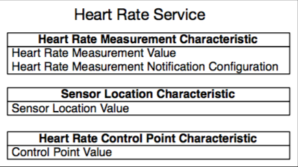

# GATT Server Service Table Example Walkthrough

## Introduction

本文介绍了ESP32的GATT服务器服务表示例代码.这个例子使用一个类似于表格的数据结构来实现一个蓝牙低功耗(BLE)通用属性(GATT)服务器来定义如图1所示的服务器服务和特征.因此,它演示了一种实际的方法来定义服务器功能,而不是逐个添加服务和特性.

此示例实现了[传统配置文件规范](https://www.bluetooth.com/specifications/profiles-overview)中定义的*心率配置文件*.

<div align="center"> </div>

## Includes

我们先来看看`gatts_table_creat_demo.c`文件中包含的头文件:

```
#include "freertos/FreeRTOS.h"
#include "freertos/task.h"
#include "freertos/event_groups.h"
#include "esp_system.h"
#include "esp_log.h"
#include "nvs_flash.h"
#include "bt.h"
#include "bta_api.h"

#include "esp_gap_ble_api.h"
#include "esp_gatts_api.h"
#include "esp_bt_defs.h"
#include "esp_bt_main.h"
#include "esp_bt_main.h"
#include “gatts_table_creat_demo.h"
```
这些包括 *FreeRTOS* 和底层系统组件需要运行,包括日志记录功能和库存储数据在非易失性闪存.我们对`bt.h`,`esp_bt_main.h`,`esp_gap_ble_api.h`和`esp_gatts_api.h`感兴趣,它们公开了实现这个例子所需的BLE API.

* `bt.h`:从主机端实现BT控制器和VHCI配置程序.
* `esp_bt_main.h`:实现Bluedroid栈的初始化和启用.
* `esp_gap_ble_api.h`:实现广播和连接参数等GAP配置.
* `esp_gatts_api.h`:实现GATT服务器配置,如创建服务和特性.

## 服务表 Service Table

头文件`gatts_table_creat_demo.h`是创建服务和特性枚举的地方:

```
enum
{
    HRS_IDX_SVC,

    HRS_IDX_HR_MEAS_CHAR,
    HRS_IDX_HR_MEAS_VAL,
    HRS_IDX_HR_MEAS_NTF_CFG,

    HRS_IDX_BOBY_SENSOR_LOC_CHAR,
    HRS_IDX_BOBY_SENSOR_LOC_VAL,

    HRS_IDX_HR_CTNL_PT_CHAR,
    HRS_IDX_HR_CTNL_PT_VAL,

    HRS_IDX_NB,
};
```
枚举元素的设置顺序与“心率配置文件”属性的顺序相同,从服务开始,然后是该服务的特征.另外,心率测量特征具有客户特征配置(CCC)描述符,该特征描述符是描述特征是否具有启用通知的附加属性.在创建实际属性表时,枚举索引可用于稍后标识每个元素.总之,这些要素描述如下:

* HRS_IDX_SVC:心率服务指数
* HRS_IDX_HR_MEAS_CHAR:心率测量特征指标
* HRS_IDX_HR_MEAS_VAL:心率测量特征值索引
* HRS_IDX_HR_MEAS_NTF_CFG:心率测量通知配置(CCC)索引
* HRS_IDX_BOBY_SENSOR_LOC_CHAR:心率体感传感器位置特征指标
* HRS_IDX_BOBY_SENSOR_LOC_VAL:心率体感传感器位置特征值索引
* HRS_IDX_HR_CTNL_PT_CHAR:心率控制点特征指标
* HRS_IDX_HR_CTNL_PT_VAL:心率控制点特征值索引
* HRS_IDX_NB:表格元素的数量.

## Main Entry Point

这个例子的入口点是`app_main()`函数:

```
void app_main()
{
    esp_err_t ret;

    // 初始化 NVS.
    ret = nvs_flash_init();
    if (ret == ESP_ERR_NVS_NO_FREE_PAGES) {
        ESP_ERROR_CHECK(nvs_flash_erase());
        ret = nvs_flash_init();
    }
    ESP_ERROR_CHECK( ret );

    esp_bt_controller_config_t bt_cfg = BT_CONTROLLER_INIT_CONFIG_DEFAULT();
    ret = esp_bt_controller_init(&bt_cfg);
    if (ret) {
        ESP_LOGE(GATTS_TABLE_TAG, "%s enable controller failed\n", __func__);
        return;
    }

    ret = esp_bt_controller_enable(ESP_BT_MODE_BTDM);
    if (ret) {
        ESP_LOGE(GATTS_TABLE_TAG, "%s enable controller failed\n", __func__);
        return;
    }

    ESP_LOGI(GATTS_TABLE_TAG, "%s init bluetooth\n", __func__);
    ret = esp_bluedroid_init();
    if (ret) {
        ESP_LOGE(GATTS_TABLE_TAG, "%s init bluetooth failed\n", __func__);
        return;
    }
    ret = esp_bluedroid_enable();
    if (ret) {
        ESP_LOGE(GATTS_TABLE_TAG, "%s enable bluetooth failed\n", __func__);
        return;
    }

    esp_ble_gatts_register_callback(   );
    esp_ble_gap_register_callback(gap_event_handler);
    esp_ble_gatts_app_register(ESP_HEART_RATE_APP_ID);
    return;
}
```

主函数首先初始化非易失性存储库,以便能够将参数保存在闪存中.

```
ret = nvs_flash_init();
```

## BT Controller and Stack Initialization

请参阅**GATT Server Example Walkthrough**中的此部分.


## Application Profiles

此示例为心率服务实施一个应用程序配置文件.应用程序配置文件是将功能设计为一个客户端应用程序使用的一种方法,例如一个智能手机移动应用程序.这样,一台服务器可以容纳不同类型的配置文件.用于识别每个配置文件的用户分配号码的应用配置文件ID用于在该堆叠中注册配置文件,在这个例子中,ID是0x55.

```
#define HEART_PROFILE_NUM                       1
#define HEART_PROFILE_APP_IDX                   0
#define ESP_HEART_RATE_APP_ID                   0x55
```

配置文件存储在`heart_rate_profile_tab`数组中.由于在这个例子中只有一个配置文件,所以一个元素被存储在数组中,其索引为0,由`HEART_PROFILE_APP_IDX`定义.此外,配置文件事件处理程序回调函数被初始化. GATT服务器上的每个应用程序使用不同的接口,由gatts_if参数表示.对于初始化,此参数设置为`ESP_GATT_IF_NONE`,稍后在注册应用程序时,gatts_if参数将使用由堆栈生成的相应接口进行更新.

```
/* One gatt-based profile one app_id and one gatts_if, this array will store the gatts_if returned by ESP_GATTS_REG_EVT */
static struct gatts_profile_inst heart_rate_profile_tab[HEART_PROFILE_NUM] = {
    [HEART_PROFILE_APP_IDX] = {
        .gatts_cb = gatts_profile_event_handler,
        .gatts_if = ESP_GATT_IF_NONE,       /* Not get the gatt_if, so initial is ESP_GATT_IF_NONE */
    },

};
```

应用程序注册在`app_main()`内使用`esp_ble_gatts_app_register()`函数进行:

```
esp_ble_gatts_app_register(ESP_HEART_RATE_APP_ID);
```

## Setting GAP Parameters

注册应用程序事件是在程序生命周期中触发的第一个事件.本示例使用此事件在配置文件事件处理程序中注册时配置广播参数.用来实现这个功能的是:

* `esp_ble_gap_set_device_name()`:用于设置通告的设备名称.
* `esp_ble_gap_config_adv_data()`:用于配置标准的广播数据.

用来配置标准的蓝牙规范的广播参数的函数是`esp_ble_gap_config_adv_data()`,它指向一个`esp_ble_adv_data_t`结构.用于广播数据的`esp_ble_adv_data_t`数据结构具有以下定义:

```c
typedef struct {
    bool set_scan_rsp; /*!< 是否将此广播数据设置为扫描响应*/
    bool include_name; /*!< 广播数据是否包含设备名 */
    bool include_txpower; /*!< 广播数据 包含 TX power */
    int min_interval; /*!< 广播数据 显示最小广播间隔 */
    int max_interval; /*!< 广播数据 显示最大广播间隔 */
    int appearance; /*!< 设备外观 */
    uint16_t manufacturer_len; /*!< 制造商数据长度 */
    uint8_t *p_manufacturer_data; /*!< 制造商数据指针 */
    uint16_t service_data_len; /*!< 服务数据长度 */
    uint8_t *p_service_data; /*!< 服务数据指针 */
    uint16_t service_uuid_len; /*!< 服务 uuid 长度 */
    uint8_t *p_service_uuid; /*!< 服务 uuid 数组指针 */
    uint8_t flag; /*!< 发现模式的广播标志，请参阅BLE_ADV_DATA_FLAG详细信息 */
} esp_ble_adv_data_t;
```

在这个例子中,结构被初始化如下:

```c
static esp_ble_adv_data_t heart_rate_adv_config = {
    .set_scan_rsp = false,
    .include_name = true,
    .include_txpower = true,
    .min_interval = 0x20,
    .max_interval = 0x40,
    .appearance = 0x00,
    .manufacturer_len = 0, //TEST_MANUFACTURER_DATA_LEN,
    .p_manufacturer_data =  NULL, //&test_manufacturer[0],
    .service_data_len = 0,
    .p_service_data = NULL,
    .service_uuid_len = sizeof(heart_rate_service_uuid),
    .p_service_uuid = heart_rate_service_uuid,
    .flag = (ESP_BLE_ADV_FLAG_GEN_DISC | ESP_BLE_ADV_FLAG_BREDR_NOT_SPT),
};
```

最小广播间隔和最大广播间隔以0.625 ms为单位设置.在本例中,最小广播时间间隔定义为0x20 * 0.625 ms = 20 ms,最大广播时间间隔初始化为0x40 * 0.625 ms = 40 ms.

广播有效载荷可以达到31个字节的数据.有些参数可能会超过31字节的通告数据包限制,这会导致堆栈切断消息,并留下一些参数.为了解决这个问题,通常较长的参数存储在扫描响应中,可以使用相同的`esp_ble_gap_config_adv_data()`功能来配置,而另外一个`esp_ble_adv_data_t`类型的结构将参数.`set_scan_rsp`设置为true.最后,要设置设备名称,使用`esp_ble_gap_set_device_name()`功能.注册事件处理程序如下所示:

```c
static void gatts_profile_event_handler(esp_gatts_cb_event_t event,
                                                                                   esp_gatt_if_t gatts_if, esp_ble_gatts_cb_param_t *param)
{
    ESP_LOGE(GATTS_TABLE_TAG, "event = %x\n",event);
    switch (event) {
        case ESP_GATTS_REG_EVT:
                ESP_LOGI(GATTS_TABLE_TAG, "%s %d\n", __func__, __LINE__);
                esp_ble_gap_set_device_name(SAMPLE_DEVICE_NAME);
                ESP_LOGI(GATTS_TABLE_TAG, "%s %d\n", __func__, __LINE__);
        esp_ble_gap_config_adv_data(&heart_rate_adv_config);

                ESP_LOGI(GATTS_TABLE_TAG, "%s %d\n", __func__, __LINE__);
…
```

## GAP Event Handler

一旦广播数据被设置,`ESP_GAP_BLE_ADV_DATA_SET_COMPLETE_EVT`由GAP事件处理程序触发和管理.而且,如果扫描响应也被设置,则也触发`ESP_GAP_BLE_SCAN_RSP_DATA_SET_COMPLETE_EVT`.一旦广播和扫描响应数据的配置已经设置,处理程序可以使用这些事件中的任何一个开始广播,这是通过使用esp_ble_gap_start_advertising()函数完成的:

```c
static void gap_event_handler(esp_gap_ble_cb_event_t event, esp_ble_gap_cb_param_t *param)
{   
    ESP_LOGE(GATTS_TABLE_TAG, "GAP_EVT, event %d\n", event);
    
    switch (event) {
    case ESP_GAP_BLE_ADV_DATA_SET_COMPLETE_EVT:
        esp_ble_gap_start_advertising(&heart_rate_adv_params);
        break;
    case ESP_GAP_BLE_ADV_START_COMPLETE_EVT:
        //广播开始完成事件以指示广播开始成功或失败
        if (param->adv_start_cmpl.status != ESP_BT_STATUS_SUCCESS) {
            ESP_LOGE(GATTS_TABLE_TAG, "Advertising start failed\n");
        }
        break;
    default:
        break;
    }
}
```

开始广播的功能需要一个需要广播参数的`esp_ble_adv_params_t`类型的结构.

```c
/// Advertising parameters
typedef struct {
    uint16_t adv_int_min; /*!< Minimum advertising interval for
					undirected and low duty cycle directed advertising.
 					Range: 0x0020 to 0x4000
 					Default: N = 0x0800 (1.28 second)
					Time = N * 0.625 msec
					Time Range: 20 ms to 10.24 sec */
    uint16_t adv_int_max; /*!< Maximum advertising interval for undirected and low duty
					cycle directed advertising. 
					Range: 0x0020 to 0x4000 
					Default: N = 0x0800 (1.28 second)
					Time = N * 0.625 msec 
					Time Range: 20 ms to 10.24 sec */
    esp_ble_adv_type_t adv_type; 		/*!< Advertising type */
    esp_ble_addr_type_t own_addr_type; 	/*!< Owner bluetooth device address type */
    esp_bd_addr_t peer_addr; 		   	/*!< Peer device bluetooth device address */
    esp_ble_addr_type_t peer_addr_type;/*!< Peer device bluetooth device address type */
    esp_ble_adv_channel_t channel_map; 		/*!< Advertising channel map */
    esp_ble_adv_filter_t adv_filter_policy; 	/*!< Advertising filter policy */
} esp_ble_adv_params_t;
```

注意`esp_ble_gap_config_adv_data()`配置了通告给客户端的数据,并且使用了`esp_ble_adv_data_t`结构,而`esp_ble_gap_start_advertising()`使服务器真正开始发布广播并且使用`esp_ble_adv_params_t`结构.广播数据是向客户端显示的信息,而广播参数是BLE堆栈执行所需的配置.

对于这个例子,广播参数被初始化如下:

```c
static esp_ble_adv_params_t heart_rate_adv_params = {
    .adv_int_min        = 0x20,
    .adv_int_max        = 0x40,
    .adv_type           = ADV_TYPE_IND,
    .own_addr_type      = BLE_ADDR_TYPE_PUBLIC,
    //.peer_addr            =
    //.peer_addr_type       =
    .channel_map        = ADV_CHNL_ALL,
    .adv_filter_policy = ADV_FILTER_ALLOW_SCAN_ANY_CON_ANY,
};
```

这些参数将广播时间间隔配置为20毫秒到40毫秒.广播的类型是ADV_IND,它是通用的,不针对特定的中央设备,并将服务器通告为可连接的.地址类型是公共的,使用所有通道并允许来自任何中央的扫描和连接请求.

如果广播成功启动,则生成`ESP_GAP_BLE_ADV_START_COMPLETE_EVT`事件,在该示例中,该事件被用于检查广播状态是否确实广播或者打印错误消息.

```c
…
    case ESP_GAP_BLE_ADV_START_COMPLETE_EVT:
        //advertising start complete event to indicate advertising start successfully or failed
        if (param->adv_start_cmpl.status != ESP_BT_STATUS_SUCCESS) {
            ESP_LOGE(GATTS_TABLE_TAG, "Advertising start failed\n");
        }
        break;
…
```

## GATT Event Handlers

在注册应用程序配置文件时,触发`ESP_GATTS_REG_EVT`事件. `ESP_GATTS_REG_EVT`的参数是:

* esp_gatt_status_t status;	/*!< Operation status */
* uint16_t app_id;            /*!< Application id which input in register API */

除了以前的参数外,事件还包含由BLE堆栈分配的GATT接口.这个事件由`gatts_event_handler()`捕获,它将生成的接口存储在配置文件表中,然后将其转发给相应的配置文件事件处理程序.

```c
static void gatts_event_handler(esp_gatts_cb_event_t event, esp_gatt_if_t gatts_if,
                                                                        esp_ble_gatts_cb_param_t *param)
{
    ESP_LOGI(GATTS_TABLE_TAG, "EVT %d, gatts if %d\n", event, gatts_if);

    /* If event is register event, store the gatts_if for each profile */
    if (event == ESP_GATTS_REG_EVT) {
        if (param->reg.status == ESP_GATT_OK) {
            heart_rate_profile_tab[HEART_PROFILE_APP_IDX].gatts_if = gatts_if;
        } else {
            ESP_LOGI(GATTS_TABLE_TAG, "Reg app failed, app_id %04x, status %d\n",
                    param->reg.app_id,
                    param->reg.status);
            return;
        }
    }

    do {
        int idx;
        for (idx = 0; idx < HEART_PROFILE_NUM; idx++) {
            if (gatts_if == ESP_GATT_IF_NONE || /* ESP_GATT_IF_NONE, not specify a certain gatt_if, need to call every profile cb function */
                    gatts_if == heart_rate_profile_tab[idx].gatts_if) {
                if (heart_rate_profile_tab[idx].gatts_cb) {
                    heart_rate_profile_tab[idx].gatts_cb(event, gatts_if, param);
                }
            }
        }
    } while (0);
}
```

## Creating Services and Characteristics with the Attribute Table

注册事件用于通过使用`esp_ble_gatts_create_attr_tab()`函数来创建配置文件属性表.这个函数接受一个类型为`esp_gatts_attr_db_t`的参数,该参数对应于由头文件中定义的枚举值所键入的查找表.

`esp_gatts_attr_db_t`结构有两个成员:

```c
esp_attr_control_t    attr_control;       /*!< The attribute control type*/
esp_attr_desc_t       att_desc;           /*!< The attribute type*/
```
`attr_control`是自动响应参数,可以设置为`ESP_GATT_AUTO_RSP`来允许BLE堆栈在读取或写入事件到达时处理响应消息.另一个选项是`ESP_GATT_RSP_BY_APP`,它允许使用`esp_ble_gatts_send_response()`函数手动响应消息.

`att_desc`是属性描述,它由以下内容组成:

```c
uint16_t uuid_length;      /*!< UUID length */  
uint8_t  *uuid_p;          /*!< UUID value */  
uint16_t perm;             /*!< Attribute permission */        
uint16_t max_length;       /*!< Maximum length of the element*/    
uint16_t length;           /*!< Current length of the element*/    
uint8_t  *value;           /*!< Element value array*/ 
```

例如,本例中表格的第一个元素是服务属性:

```
[HRS_IDX_SVC]                       =
    {{ESP_GATT_AUTO_RSP}, {ESP_UUID_LEN_16, (uint8_t *)&primary_service_uuid, ESP_GATT_PERM_READ,
      sizeof(uint16_t), sizeof(heart_rate_svc), (uint8_t *)&heart_rate_svc}},
```

初始化值是:

* `[HRS_IDX_SVC]`:在枚举表中命名或指定的初始值设定项.
* `ESP_GATT_AUTO_RSP`:自动响应配置,设置为由堆栈自动响应.
* `ESP_UUID_LEN_16`:UUID长度设置为16位.
* ``(uint8_t *)&primary_service_uuid``:UUID将服务标识为主服务(0x2800).
* `ESP_GATT_PERM_READ`:读取服务的权限.
* ``sizeof(uint16_t)``:服务UUID的最大长度(16位).
* ``sizeof(heart_rate_svc)``:当前服务长度设置为变量*heart_rate_svc*的大小,即16位.
* ``(uint8_t *)&heart_rate_svc``:服务属性值设置为包含心率服务UUID(0x180D)的变量*heart_rate_svc*.

其余的属性以相同的方式初始化.一些属性也有``&char_prop_notify``设置的 *NOTIFY* 属性.完整的表结构如下初始化:

```c
/// Full HRS Database Description - Used to add attributes into the database
static const esp_gatts_attr_db_t heart_rate_gatt_db[HRS_IDX_NB] =
{
    // Heart Rate Service Declaration
    [HRS_IDX_SVC]                       =
    {{ESP_GATT_AUTO_RSP}, {ESP_UUID_LEN_16, (uint8_t *)&primary_service_uuid, ESP_GATT_PERM_READ,
      sizeof(uint16_t), sizeof(heart_rate_svc), (uint8_t *)&heart_rate_svc}},

    // Heart Rate Measurement Characteristic Declaration
    [HRS_IDX_HR_MEAS_CHAR]            =
    {{ESP_GATT_AUTO_RSP}, {ESP_UUID_LEN_16, (uint8_t *)&character_declaration_uuid, ESP_GATT_PERM_READ,
      CHAR_DECLARATION_SIZE,CHAR_DECLARATION_SIZE, (uint8_t *)&char_prop_notify}},

    // Heart Rate Measurement Characteristic Value
    [HRS_IDX_HR_MEAS_VAL]               =
    {{ESP_GATT_AUTO_RSP}, {ESP_UUID_LEN_16, (uint8_t *)&heart_rate_meas_uuid, ESP_GATT_PERM_READ,
      HRPS_HT_MEAS_MAX_LEN,0, NULL}},

    // Heart Rate Measurement Characteristic - Client Characteristic Configuration Descriptor
    [HRS_IDX_HR_MEAS_NTF_CFG]           =
    {{ESP_GATT_AUTO_RSP}, {ESP_UUID_LEN_16, (uint8_t *)&character_client_config_uuid, ESP_GATT_PERM_READ|ESP_GATT_PERM_WRITE,
      sizeof(uint16_t),sizeof(heart_measurement_ccc), (uint8_t *)heart_measurement_ccc}},

    // Body Sensor Location Characteristic Declaration
    [HRS_IDX_BOBY_SENSOR_LOC_CHAR]  =
    {{ESP_GATT_AUTO_RSP}, {ESP_UUID_LEN_16, (uint8_t *)&character_declaration_uuid, ESP_GATT_PERM_READ,
      CHAR_DECLARATION_SIZE,CHAR_DECLARATION_SIZE, (uint8_t *)&char_prop_read}},

    // Body Sensor Location Characteristic Value
    [HRS_IDX_BOBY_SENSOR_LOC_VAL]   =
    {{ESP_GATT_AUTO_RSP}, {ESP_UUID_LEN_16, (uint8_t *)&body_sensor_location_uuid, ESP_GATT_PERM_READ,
      sizeof(uint8_t), sizeof(body_sensor_loc_val), (uint8_t *)body_sensor_loc_val}},

    // Heart Rate Control Point Characteristic Declaration
    [HRS_IDX_HR_CTNL_PT_CHAR]          =
    {{ESP_GATT_AUTO_RSP}, {ESP_UUID_LEN_16, (uint8_t *)&character_declaration_uuid, ESP_GATT_PERM_READ,
      CHAR_DECLARATION_SIZE,CHAR_DECLARATION_SIZE, (uint8_t *)&char_prop_read_write}},

    // Heart Rate Control Point Characteristic Value
    [HRS_IDX_HR_CTNL_PT_VAL]             =
    {{ESP_GATT_AUTO_RSP}, {ESP_UUID_LEN_16, (uint8_t *)&heart_rate_ctrl_point, ESP_GATT_PERM_WRITE|ESP_GATT_PERM_READ,
      sizeof(uint8_t), sizeof(heart_ctrl_point), (uint8_t *)heart_ctrl_point}},
};
```

## Starting the Service
当属性表被创建时,会触发一个`ESP_GATTS_CREAT_ATTR_TAB_EVT`事件.此事件具有以下参数:

* ``esp_gatt_status_t status``;    /*!< Operation status */
* ``esp_bt_uuid_t svc_uuid``;      /*!< Service uuid type */
	 ``uint16_t num_handle``;         /*!< The number of the attribute handle to be added to the gatts 	      database */
* ``uint16_t *handles``;           /*!< The number to the handles */

此示例使用此事件来打印信息并检查创建的表的大小是否等于枚举HRS_IDX_NB中元素的数量.如果表格被正确创建,属性句柄被复制到句柄表heart_rate_handle_table中,服务使用``esp_ble_gatts_start_service()``函数启动:

```c
case ESP_GATTS_CREAT_ATTR_TAB_EVT:{
        ESP_LOGI(GATTS_TABLE_TAG, "The number handle =%x\n",param->add_attr_tab.num_handle);
        if (param->add_attr_tab.status != ESP_GATT_OK){
            ESP_LOGE(GATTS_TABLE_TAG, "Create attribute table failed, error code=0x%x", param->add_attr_tab.status);
        }
        else if (param->add_attr_tab.num_handle != HRS_IDX_NB){
            ESP_LOGE(GATTS_TABLE_TAG, "Create attribute table abnormally, num_handle (%d) \
                    doesn't equal to HRS_IDX_NB(%d)", param->add_attr_tab.num_handle, HRS_IDX_NB);
        }
        else {
            memcpy(heart_rate_handle_table, param->add_attr_tab.handles, sizeof(heart_rate_handle_table));
            esp_ble_gatts_start_service(heart_rate_handle_table[HRS_IDX_SVC]);
        }
        break;
```

存储在事件参数句柄指针中的句柄是标识每个属性的数字.可以使用句柄来知道正在读取或写入哪个特征,因此可以将它们传递到应用程序的上层以处理不同的动作.

最后,heart_rate_handle_table包含结构形式的Application Profile,其中包含关于属性参数以及GATT接口,连接ID,权限和应用程序ID的信息.配置文件结构如下所示,注意并不是所有的成员都在这个例子中使用:

```c
struct gatts_profile_inst {
    esp_gatts_cb_t gatts_cb;
    uint16_t gatts_if;
    uint16_t app_id;
    uint16_t conn_id;
    uint16_t service_handle;
    esp_gatt_srvc_id_t service_id;
    uint16_t char_handle;
    esp_bt_uuid_t char_uuid;
    esp_gatt_perm_t perm;
    esp_gatt_char_prop_t property;
    uint16_t descr_handle;
    esp_bt_uuid_t descr_uuid;
};
```

## Conclusion
本文档解释了实现心率配置文件的GATT服务器服务表示例代码的工作流程.此示例首先定义一个包含服务器所有服务和特性的属性表,然后注册触发用于配置GAP参数和创建服务表的事件的应用程序配置文件.使用每个属性所需的所有参数初始化服务表,并启动服务.这个例子展示了通过使用一个表而不是逐个添加特征来定义服务器属性的一种实用的方法.


